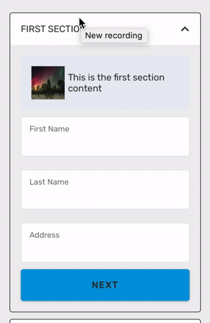

# Accordion

A component used to display expandable list items.

### Preview



### Props

| Name                    |                                          Type                                           |                                Default                                 | Description                                                                                                    |
| ----------------------- | :-------------------------------------------------------------------------------------: | :--------------------------------------------------------------------: | -------------------------------------------------------------------------------------------------------------- |
| `sections *`            |                           `Array<T extends {title: string}>`                            |                                                                        | An array of sections passed to the render methods. In order                                                    |
| `useRipple`             |                                        `boolean`                                        |                                `false`                                 | Determine whether to use Material Ripple Effect or not.                                                        |
| `renderHeader *`        | `(content: T, index: number, isActive: boolean, sections: Array<T>) => React.Component` |                         Exoflex custom header                          | A function that should return a renderable representing the header.                                            |
| `renderContent *`       | `(content: T, index: number, isActive: boolean, sections: Array<T>) => React.Component` |                                                                        | A function that should return a renderable representing the content.                                           |
| `renderFooter`          | `(content: T, index: number, isActive: boolean, sections: Array<T>) => React.Component` |                                                                        | A function that should return a renderable representing the footer.                                            |
| `renderSectionTitle`    |           `(content: T, index: number, isActive: boolean) => React.Component`           |                                                                        | A function that should return a renderable representing the title of the section outside the touchable element |
| `renderIconLeft`        |                      `(animation: Animated.Value) => void \| null`                      |                                                                        | Custom icon to be display on the left of the header.                                                           |
| `renderIconRight`       |                      `(animation: Animated.Value) => void \| null`                      |                               arrow icon                               | Custom icon to be display on the right of the header.                                                          |
| `onChange`              |                           `(indexes: Array<number>) => void`                            |                                                                        | A function that is called when the currently active section(s) are updated.                                    |
| `activeSections`        |                                     `Array<number>`                                     |                                                                        | Control which indices in the sections array are currently open. If empty, closes all sections.                 |
| `underlayColor`         |                                        `string`                                         |                                'black'                                 | The color of the underlay that will show through when tapping on headers.                                      |
| `touchableComponent`    |           `(content: T, index: number, isActive: boolean) => React.Component`           | [RNP](https://callstack.github.io/react-native-paper/) TouchableRipple | The touchable component used in the Accordion.                                                                 |
| `touchableProps`        |                                 `{[key: string]: any}`                                  |                                                                        | Properties for the touchableComponent.                                                                         |
| `disabled`              |                                        `boolean`                                        |                                `false`                                 | Set whether the user can interact with the Accordion                                                           |
| `align`                 |                               `'top'\|'center'\|'bottom'`                               |                                `'top'`                                 | Alignment of the content when transitioning                                                                    |
| `duration`              |                                        `number`                                         |                                 `300`                                  | A function that should return a renderable representing the title of the section outside the touchable element |
| `onAnimationEnd`        |                                      `() => void`                                       |                               `() => {}`                               | Callback when the toggle animation is done. Useful to avoid heavy layouting work during the animation.         |
| `expandFromBottom`      |                                        `boolean`                                        |                                                                        | Expand content from the bottom instead of the top.                                                             |
| `expandMultiple`        |                                        `boolean`                                        |                                `false`                                 | Allow more than one section to be expanded.                                                                    |
| `sectionContainerStyle` |                                 `StyleProp<ViewStyle>`                                  |                                                                        | Optional styling for the section container.                                                                    |
| `containerStyle`        |                                 `StyleProp<ViewStyle>`                                  |                                                                        | Optional styling for the Accordion container.                                                                  |
| `headerContainerStyle`  |                                 `StyleProp<ViewStyle>`                                  |                                                                        | Optional styling for the Accordion header container.                                                           |
| `headerStyle`           |                                 `StyleProp<TextStyle>`                                  |                                                                        | Optional styling for the Accordion header.                                                                     |
| `iconStyle`             |                                 `StyleProp<ViewStyle>`                                  |                                                                        | Optional styling for the Header icon.                                                                          |

Props marked with `*` are required.

### Example

```tsx
let sections = [
  {
    title: 'First Section',
    text: 'This is the content for the first section',
    image: firstImage,
  },
  {
    title: 'Second Section',
    text: 'This is the content for the second section',
    image: secondImage,
  },
];
let [activeSections, setActiveSections] = useState([]);

<Provider>
  <Accordion
    sections={sections}
    activeSections={activeSections}
    onChange={(sections) => setActiveSections(sections)}
    renderContent={(content, index) => (
      <View>
        <Text style={styles.flex}>{content.text}</Text>
      </View>
    )}
  />
  <Accordion
    sections={sections}
    activeSections={activeSections}
    onChange={(sections) => setActiveSections(sections)}
    titleContainerStyle={{
      justifyContent: 'center',
      alignItems: 'center',
      borderRadius: 4,
    }}
    titleStyle={{ fontWeight: 'bold' }}
    renderContent={(content, index) => (
      <View style={{ padding: 16 }}>
        <View
          style={{
            padding: 16,
            backgroundColor: '#e8ecf3',
            flexDirection: 'row',
            alignItems: 'center',
            borderRadius: roundness,
          }}
        >
          <Image
            source={content.image}
            style={{ width: 50, height: 50, marginRight: 5 }}
          />
          <Text style={{ flex: 1 }}>{content.text}</Text>
        </View>
        {index === 0 && (
          <>
            <TextInput
              label="First Name"
              containerStyle={{ marginVertical: 10 }}
            />
            <TextInput
              label="Last Name"
              containerStyle={{ marginVertical: 10 }}
            />
            <TextInput
              label="Address"
              containerStyle={{ marginVertical: 10 }}
            />
            <Button onPress={() => setActiveSections([1])}>next</Button>
          </>
        )}
      </View>
    )}
    sectionContainerStyle={{
      borderWidth: 1,
      borderColor: '#454545',
      marginVertical: 5,
      borderRadius: roundness,
    }}
  />
</Provider>;
```
