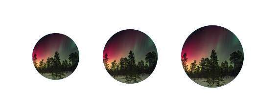

# Avatar.Image

Avatars can be used to represent people in a graphical way.

### Preview



### Props

| Name       |         Type          | Default | Description                      |
| ---------- | :-------------------: | :-----: | -------------------------------- |
| `source *` | `ImageSourcePropType` |         | Image to display for the Avatar. |
| `size`     |       `number`        |  `64`   | Size of the avatar.              |
| `style`    | `StyleProp<ViewStye>` |         | Style for the container.         |

Props marked with \* are required.

### Example

```tsx
<Provider>
  <Avatar.Image source={avatarImage} />
  <Avatar.Image source={avatarImage} size={56} />
</Provider>
```
