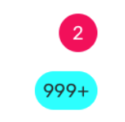

# Badge

### Preview



### Props

| Name         |          Type          | Default | Description                                           |
| ------------ | :--------------------: | :-----: | ----------------------------------------------------- |
| `children *` |   `string | number`    |         | Content of the `Badge`.                               |
| `visible`    |       `boolean`        | `true`  | Whether the badge is visible.                         |
| `size`       |        `number`        |  `20`   | Size of the badge.                                    |
| `style`      | `StyleProp<TextStyle>` |         | Additional style passed to the text inside the Badge. |

### Example

```tsx
<Provider>
  <Badge>2</Badge>
  <Badge style={{ backgroundColor: 'cyan' }}>999+</Badge>
</Provider>
```
