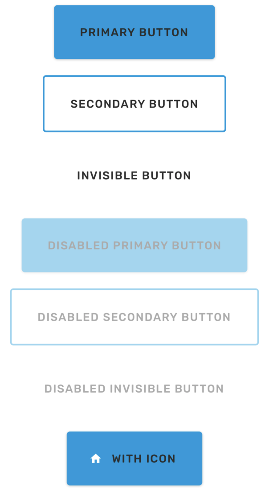

# Button

Button with three presets. Use within the `Provider` component to be able to change the button color as it depends on the theme.

### Preview



### Props

| Name           |                                                            Type                                                             |   Default   | Description                                                                                                                                                                                                                                                                                                                 |
| -------------- | :-------------------------------------------------------------------------------------------------------------------------: | :---------: | --------------------------------------------------------------------------------------------------------------------------------------------------------------------------------------------------------------------------------------------------------------------------------------------------------------------------- |
| `children *`   |                                                         `ReactNode`                                                         |             | Label text of the button.                                                                                                                                                                                                                                                                                                   |
| `preset`       |                                                          `string`                                                           | `'primary'` | Mode of the button. You can change the mode to adjust the styling to give it desired emphasis.<br>- `primary` - button with a background color and elevation shadow (high emphasis)<br>- `secondary` - button with an outline (medium emphasis)<br>- `invisible` - flat button without background or outline (low emphasis) |
| `textPreset`   |                                                          `string`                                                           |             | Name of font preset that will be used on `Text` component inside the `Button`. This prop won't work with custom children.                                                                                                                                                                                                   |
| `onPress`      |                                                        `() => void`                                                         |             | Function that will be invoked when the `Button` pressed.                                                                                                                                                                                                                                                                    |
| `useRipple`    |                                                          `boolean`                                                          |   `false`   | Whether to use Material Ripple Effect or not. Only for Android and Web.                                                                                                                                                                                                                                                     |
| `disabled`     |                                                          `boolean`                                                          |             | Whether to disable the press functionality.                                                                                                                                                                                                                                                                                 |
| `loading`      |                                                          `boolean`                                                          |             | Whether to show a loading indicator.                                                                                                                                                                                                                                                                                        |
| `icon`         | `string` \| `number` \| `ImageURISource` \| `Array<ImageURISource>` \| `({color: string, size: number}) => React.ReactNode` |             | Icon to display for the `Button`.                                                                                                                                                                                                                                                                                           |
| `uppercase`    |                                                          `boolean`                                                          |             | Make the label text uppercased. Note that this won't work if you pass React elements as children.                                                                                                                                                                                                                           |
| `contentStyle` |                                                   `StyleProp<ViewStyle>`                                                    |             | Style of button's inner content.                                                                                                                                                                                                                                                                                            |
| `style`        |                                                   `StyleProp<ViewStyle>`                                                    |             | Style of button's outer content.                                                                                                                                                                                                                                                                                            |
| `labelStyle`   |                                                   `StyleProp<TextStyle>`                                                    |             | Style for the button text. This is only work when the children is a string, not a custom component.                                                                                                                                                                                                                         |

Props marked with \* are required.

### Example

```tsx
<Provider>
  <Button onPress={() => {}}>Primary button</Button>

  <Button preset="secondary" onPress={() => {}}>
    Secondary button
  </Button>

  <Button preset="invisible" onPress={() => {}}>
    Invisible button
  </Button>

  <Button disabled preset="primary" onPress={() => {}}>
    Disabled Primary button
  </Button>

  <Button disabled preset="secondary" onPress={() => {}}>
    Disabled Secondary button
  </Button>

  <Button disabled preset="invisible" onPress={() => {}}>
    Disabled Invisible button
  </Button>

  <Button icon="home" onPress={() => {}}>
    With Icon
  </Button>
</Provider>
```
