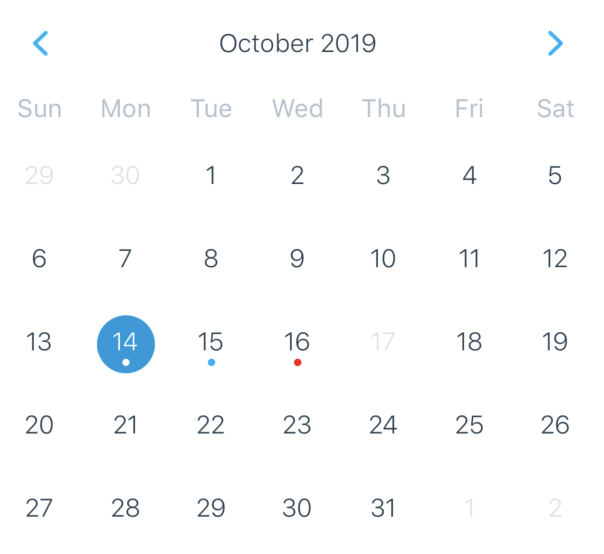

# Calendar

A component used to show a calendar to pick a date.

### Preview



### Props

```tsx
type DateObject = {
  day: number; // day of month (1-31)
  month: number; // month of year (1-12)
  year: number; // year
  timestamp: number; // UTC timestamp representing 00:00 AM of this date
  dateString: string; // date formatted as 'YYYY-MM-DD' string
};
```

| Name                      |                              Type                               |    Default    | Description                                                                                                                                         |
| ------------------------- | :-------------------------------------------------------------: | :-----------: | --------------------------------------------------------------------------------------------------------------------------------------------------- |
| `textPreset`              |                            `string`                             |               | A preset of font to use when determining the font style.                                                                                            |
| `current`                 |         `Date | DateObject | number | string | XDate;`          |    `Date`     | Initially visible month.                                                                                                                            |
| `minDate`                 |                            `string`                             |               | Minimum date that can be selected, dates before minDate will be grayed out.                                                                         |
| `maxDate`                 |                            `string`                             |    `false`    | Maximum date that can be selected, dates after maxDate will be grayed out.                                                                          |
| `monthFormat`             |                            `string`                             | `'MMMM yyyy'` | Month format in calendar title. Formatting values: http://arshaw.com/xdate/#Formatting                                                              |
| `markingType`             | `'custom' \| 'simple' \| 'multi-dot' \| 'multi-period' \| 'period'` |  `'simple'`   | Marking style on the date.                                                                                                                          |
| `markedDates`             |                  `{ [date: string]: Marking }`                  |  `'simple'`   | Marking style on the date.                                                                                                                          |
| `firstDay`                |                            `number`                             |      `0`      | If firstDay=1 week starts from Monday. Note that dayNames and dayNamesShort should still start from Sunday.                                         |
| `hideArrows`              |                            `boolean`                            |    `false`    | Hide month navigation arrows.                                                                                                                       |
| `hideExtraDays`           |                            `boolean`                            |    `false`    | Do not show days of other months in month page.                                                                                                     |
| `disableMonthChange`      |                            `boolean`                            |    `false`    | If hideArrows=false and hideExtraDays=false do not switch month when tapping on greyed out day from another month that is visible in calendar page. |
| `disabledByDefault`       |                            `boolean`                            |    `false`    | Disable days by default.                                                                                                                            |
| `hideDayNames`            |                            `boolean`                            |    `false`    | Hide day names.                                                                                                                                     |
| `showWeekNumbers`         |                            `boolean`                            |    `false`    | Show week numbers to the left.                                                                                                                      |
| `displayLoadingIndicator` |                            `boolean`                            |    `false`    | Display loading indicator.                                                                                                                          |
| `dayComponent`            |                  `React.Component \| React.SFC`                  |               | Provide custom day rendering component.                                                                                                             |
| `renderArrow`             |          `(direction: 'left' | 'right') => JSXElement`          |               | Replace default arrows with custom ones.                                                                                                            |
| `style`                   |                     `StyleProp<ViewStyle>`                      |               | Calendar container style.                                                                                                                           |
| `onDayPress`              |                   `(day: DateObject) => void`                   |               | Handler which gets executed on day press.                                                                                                           |
| `onDayLongPress`          |                   `(day: DateObject) => void`                   |               | Handler which gets executed on day long press.                                                                                                      |
| `onMonthChange`           |                  `(month: DateObject) => void`                  |               | Handler which gets executed when visible month changes in calendar.                                                                                 |
| `onPressArrowLeft`        |             `(substractMonth: () => void) => void`              |               | Handler which gets executed when press arrow icon left. It receive a callback that can go back month.                                               |
| `onPressArrowRight`       |                `(addMonth: () => void) => void`                 |               | Handler which gets executed when press arrow icon left. It receive a callback that can go next month.                                               |
| `onVisibleMonthsChange`   |                `(months: DateObject[]) => void`                 |               | Callback which gets executed when visible months change in scroll view.                                                                             |

> NOTE: You can check this page for more information. https://github.com/wix/react-native-calendars

```tsx
export type Marking =
  | CustomMarking
  | DotMarking
  | MultiDotMarking
  | MultiPeriodMarking
  | PeriodMarking;

export interface MarkedDateCustomStyles {
  container: StyleProp<ViewStyle>;
  text: StyleProp<TextStyle>;
}

export interface CalendarDot {
  key: string;
  color: string;
  selectedDotColor?: string;
}

export interface CustomMarking {
  customStyles: MarkedDateCustomStyles;
}

export interface DotMarking {
  activeOpacity?: number;
  disabled?: boolean;
  disableTouchEvent?: boolean;
  dotColor?: string;
  marked?: boolean;
  selected?: boolean;
  selectedColor?: string;
}

export interface MultiDotMarking {
  disabled?: boolean;
  dots: CalendarDot[];
  selected?: boolean;
  selectedColor?: string;
}

export interface MultiPeriodMarking {
  periods: Array<{
    startingDay?: boolean;
    endingDay?: boolean;
    color?: string;
  }>;
}

export interface PeriodMarking {
  textColor?: string;
  startingDay?: boolean;
  color?: string;
  selected?: boolean;
  endingDay?: boolean;
  disabled?: boolean;
}
```

### Example

```tsx
<Provider>
  <Calendar />
  <Calendar onDayPress={(day) => setSelectedDate(new Date(day.timestamp).toString())}>
  <Calendar
    markedDates={{ '2019-10-12': { selected: true } }}
  />
</Provider>
```
