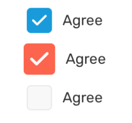

# Checkbox

A checkbox with text. Checkboxes allow the user to select one or more items from a set.

### Preview



| Prop        | Type                          | Default               | Description                                                                                     |
| ----------- | ----------------------------- | --------------------- | ----------------------------------------------------------------------------------------------- |
| `checked`   | `boolean`                     | `false`               | Boolean whether the checkbox is checked or not.                                                 |
| `label`     | `string`                      | `''`                  | The text/string for the checkbox.                                                               |
| `onPress`   | `(newValue: boolean) => void` | `() => {}`            | Callback function to be called when checkbox is pressed.                                        |
| `color`     | `string`                      | `Theme primary color` | The color of the checkbox icon. Default to theme primary color.                                 |
| `disabled`  | `boolean`                     | `false`               | Boolean whether the checkbox is disabled or not. If disabled, no press event will be triggered. |
| `size`      | `number`                      | `24`                  | The size of the check icon.                                                                     |
| `style`     | `StyleProp<ViewStyle>`        |                       | Additional style for the checkbox container.                                                    |
| `textStyle` | `StyleProp<TextStyle>`        |                       | Additional style for the text.                                                                  |

### Example

```tsx
let [checkboxValue, setCheckboxValue] = useState(false);

<Provider>
  <Checkbox
    checked={checkboxValue}
    label="Agree"
    onPress={(newValue) => {
      setCheckboxValue(newValue);
    }}
  />
  <Checkbox
    checked={checkboxValue}
    label="Agree"
    onPress={(newValue) => {
      setCheckboxValue(newValue);
    }}
    size={30}
    color="tomato"
  />
  <Checkbox checked={false} label="Agree" disabled={true} />
</Provider>;
```
