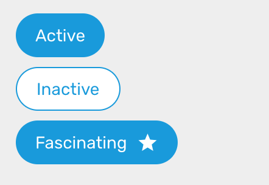

# Chip

### Preview



### Props

| Name                                                                                         |           Type           |  Default   | Description                                                            |
| -------------------------------------------------------------------------------------------- | :----------------------: | :--------: | ---------------------------------------------------------------------- |
| `children`                                                                                   |         `string`         |            | String to display inside the chip.                                     |
| `mode`                                                                                       | `'active' \| 'inactive'` | `'active'` | Determine how the chip is displayed.                                   |
| `textStyle`                                                                                  |  `StyleProp<TextStyle>`  |            | Additional style passed to the text inside the chip.                   |
| `icon`                                                                                       |       `IconSource`       |            | Icon to display. Accept the same `icon` as [IconButton](IconButton.md) |
| `iconStyle`                                                                                  |  `StyleProp<ViewStyle>`  |            | Additional style passed to the icon.                                   |
| [TouchableOpacityProps](https://facebook.github.io/react-native/docs/touchableopacity#props) |                          |            | Additional touchable props will be spread to the Chip component.       |

### Example

```tsx
<Provider>
  <Chip>Subarashi</Chip>

  <Chip mode="inactive">Codo</Chip>

  <Chip icon="star">Fascinating</Chip>
</Provider>
```
