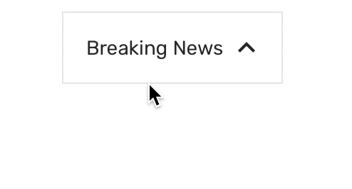

# Collapsible

Collapsible with animation.

### Preview



### Props

| Name                    |                           Type                           |                                                    Default                                                     | Description                                                                                                                                                                                                  |
| ----------------------- | :------------------------------------------------------: | :------------------------------------------------------------------------------------------------------------: | ------------------------------------------------------------------------------------------------------------------------------------------------------------------------------------------------------------ |
| `children *`            |                       `ReactNode`                        |                                                                                                                | Content that'll be hidden when collapsed.                                                                                                                                                                    |
| `isCollapsed`           |                        `boolean`                         |                                                                                                                | Whether the collapsible is collapse. If this prop is provided, the collapsible will behave as a "controlled component". You'll need to update this prop when you want to toggle the component or on onPress. |
| `contentContainerStyle` |                  `StyleProp<ViewStyle>`                  |                                               `{ padding: 16 }`                                                | Additional style for the content container.                                                                                                                                                                  |
| `titleContainerStyle`   |                  `StyleProp<ViewStyle>`                  |               `{ flexDirection: 'row', alignItems: 'center', paddingHorizontal: 16, height: 48}`               | Additional style for the title container.                                                                                                                                                                    |
| `iconStyle`             |                  `StyleProp<ViewStyle>`                  | `{ margin: 0, ...Platform.select({web: {}, default: {position: 'absolute', right: 5, alignSelf: 'center'}}) }` | Additional style for the icon.                                                                                                                                                                               |
| `style`                 |                  `StyleProp<ViewStyle>`                  |                                      `{ borderWidth: 1, width: '100%' }`                                       | Additional style for the outer container.                                                                                                                                                                    |
| `title *`               |                         `string`                         |                                                                                                                | Text displayed as the title of the collapsible.                                                                                                                                                              |
| `titleStyle`            |                  `StyleProp<TextStyle>`                  |                                  `{ marginRight: 24, flexWrap: 24, flex: 1 }`                                  | Additional style for the title.                                                                                                                                                                              |
| `renderLeftIcon`        | `(animatedValue: Animated.Value) => ReactNode \|\| null` |                                                                                                                | Custom icon to be display on the left of the title.                                                                                                                                                          |
| `renderRightIcon`       | `(animatedValue: Animated.Value) => ReactNode \|\| null` |                                                   arrow icon                                                   | Custom icon to be display on the right of the title. Set this to `null` if you don't want to display the icon                                                                                                |
| `disabled`              |                        `boolean`                         |                                                     false                                                      | Whether the collapsible can be toggle on header click                                                                                                                                                        |

Prop marked with `*` is required.

### Example

```tsx
<Provider>
  <Collapsible title="Default collapsible">
    <Text>Hello!</Text>
  </Collapsible>
  <Collapsible
    isCollapsed={true}
    title="Default collapsible with no icon"
    renderIconRight={null}
  >
    <Text>Hello!</Text>
  </Collapsible>
  <Collapsible
    title="With custom right icon"
    renderIconRight={(value) => (
      <Animated.View
        style={{
          transform: [
            {
              rotate: value.interpolate({
                inputRange: [0, 1],
                outputRange: ['-45deg', '45deg'],
              }),
            },
          ],
        }}
      >
        <IconButton icon="arrow-upward" />
      </Animated.View>
    )}
  >
    <Text>Hello!</Text>
  </Collapsible>
  <Collapsible
    title="With left icon (no animation)"
    renderIconLeft={() => <IconButton icon="arrow-downward" />}
    renderIconRight={null}
  >
    <Text>Hello2!</Text>
  </Collapsible>
  <Collapsible
    title="Custom left icon and default right icon"
    renderIconLeft={() => <IconButton icon="camera" style={{ margin: 0 }} />}
  >
    <Text>Hello!</Text>
  </Collapsible>
</Provider>
```
