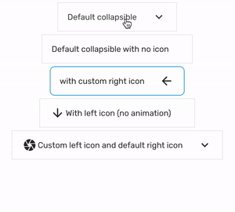

# Collapsible

Collapsible with animation.

### Preview



### Props

| Name                    |          Type          |               Default                | Description                                     |
| ----------------------- | :--------------------: | :----------------------------------: | ----------------------------------------------- |
| `children *`            |      `ReactNode`       |             `undefined`              | Content that'll be hidden when collapsed.       |
| `contentContainerStyle` | `StyleProp<ViewStyle>` |          `{ padding: 16 }`           | Additional style for the content container.     |
| `iconStyle`             | `StyleProp<ViewStyle>` | `{ position: 'absolute', right: 0 }` | Additional style for the icon.                  |
| `style`                 | `StyleProp<ViewStyle>` |         `{ borderWidth: 1 }`         | Additional style for the outer container.       |
| `title *`               |        `string`        |             `undefined`              | Text displayed as the title of the collapsible. |
| `titleStyle`            | `StyleProp<TextStyle>` |        `{ marginRight: 24 }`         | Additional style for the title.                 |

Prop marked with `*` is required.

### Example

```tsx
<Provider>
  <Collapsible title="Breaking News">
    <Text>Nah</Text>
  </Collapsible>
</Provider>
```

