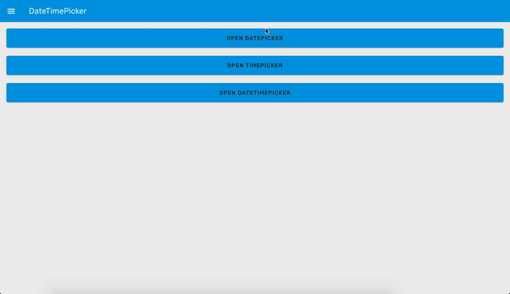
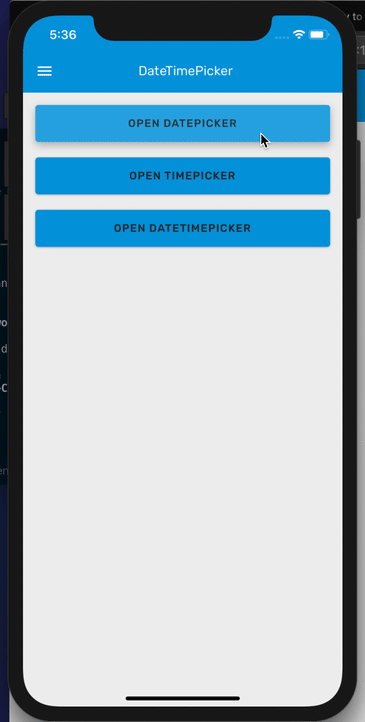
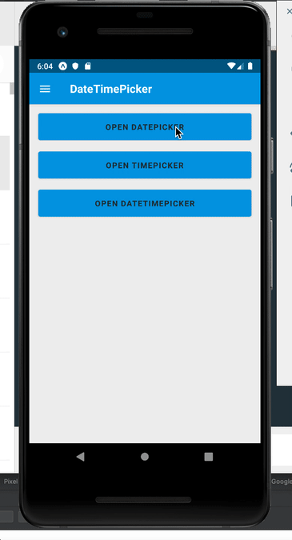

# DateTimePicker

### Preview

<p align="center">
  
</p>
<p align="center">
  
  
</p>

### Props

| Name                    |                  Type                  |                        Default                        | Description                                                                           |
| ----------------------- | :------------------------------------: | :---------------------------------------------------: | ------------------------------------------------------------------------------------- |
| `mode`                  |    `'date' \| 'time' \| 'datetime'`    |                     `'datetime'`                      | Determines whether to displaying a `DatePicker`, `TimePicker`, or both.               |
| `date`                  |                `string`                |                                                       | Current date and time in ISO string format. (Empty string also accepted.)             |
| `locale`                |                `string`                |                                                       | Set the date picker locale.                                                           |
| `isVisible`             |               `boolean`                |                                                       | Whether to show the picker or not.                                                    |
| `use24Hour`             |               `boolean`                |                                                       | Whether to show the time in 24h or 12h format.                                        |
| `minimumDate`           |                 `Date`                 |                                                       | Set the minimum date that can be selected.                                            |
| `maximumDate`           |                 `Date`                 |                                                       | Set the maximum date that can be selected.                                            |
| `datePickerModeAndroid` | `'spinner' \| 'calendar' \| 'default'` |                      `'default'`                      | Toggles the date mode on Android between spinner and calendar views. (Android only.)  |
| `timePickerModeAndroid` |  `'spinner' \| 'clock' \| 'default'`   |                      `'default'`                      | Toggles the time mode on Android between spinner and clock views. (Android only.)     |
| `onCancel *`            |              `() => void`              |                                                       | Callback when the cancel button pressed.                                              |
| `onConfirm *`           |        `(date: string) => void`        |                                                       | Callback when the confirm pressed. It returns the selected date in ISO string format. |
| `format`                |         `'12' \| '24' \| '12'`         | Format to show the time, between 12 hour and 24 hour. |
| `placeholder`           |                `string`                |                         `''`                          | Placeholder to show inside the TextInput. (For iOS and Android only)                  |
| `title`                 |                `string`                |                         `''`                          | The title text on iOS and web.                                                        |
| `dateTitle`             |                `string`                |                         `''`                          | The title text on web for date picker.                                                |
| `timeTitle`             |                `string`                |                         `''`                          | The title text on web for time picker.                                                |
| `onChangeTime`          |     `(isoString: string) => void`      |                                                       | Callback when a time is picked. It returns an ISO string.                             |
| `style`                 |         `StyleProp<TextStyle>`         |                                                       | Style for the TextInput. (For iOS and Android only)                                   |

Props marked with \* are required.

### Example

```tsx
<Provider>
  <DateTimePicker
    isVisible={isDateTimePickerVisible}
    date={date1}
    onCancel={() => setDateTimePickerVisible(false)}
    onConfirm={(date) => {
      setDate1(date);
      setDateTimePickerVisible(false);
    }}
  />
  <DateTimePicker
    isVisible={isDatePickerVisible}
    date={date2}
    mode="date"
    onCancel={() => setDatePickerVisible(false)}
    onConfirm={(date) => {
      setDate2(date);
      setDatePickerVisible(false);
    }}
  />
</Provider>
```
