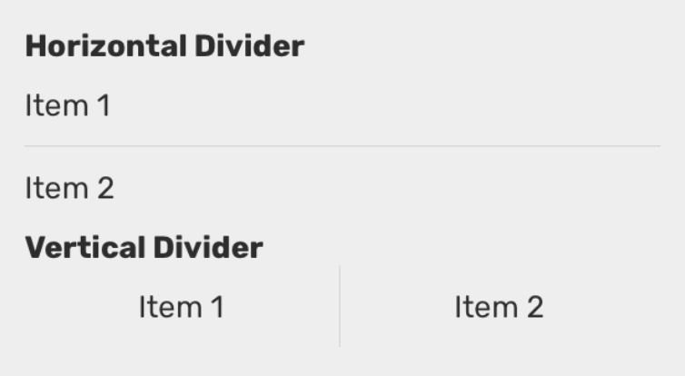

# Divider

### Preview



### Props

| Name    |             Type             |    Default     | Description                                                                                                        |
| ------- | :--------------------------: | :------------: | ------------------------------------------------------------------------------------------------------------------ |
| `mode`  | `'horizontal' \| 'vertical'` | `'horizontal'` | Whether the divider direction is horizontal or vertical.                                                           |
| `style` |    `StyleProp<ViewStyle>`    |                | Additional style passed to the divider. To change the color of the divider, you can pass backgroundColor property. |
| `inset` |           `number`           |                | Left inset for the horizontal divider                                                                              |

### Example

```tsx
<Provider>
  <View>
    <Text>Item 1</Text>
    <Divider />
    <Text>Item 2</Text>
  </View>

  <View style={{ flexDirection: 'row' }}>
    <Text>Item 1</Text>
    <Divider mode="vertical" />
    <Text>Item 2</Text>
  </View>
</Provider>
```
