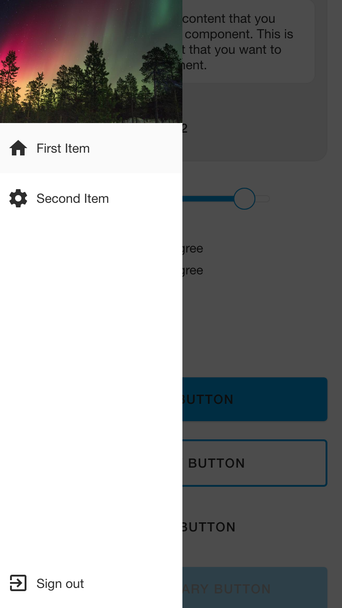
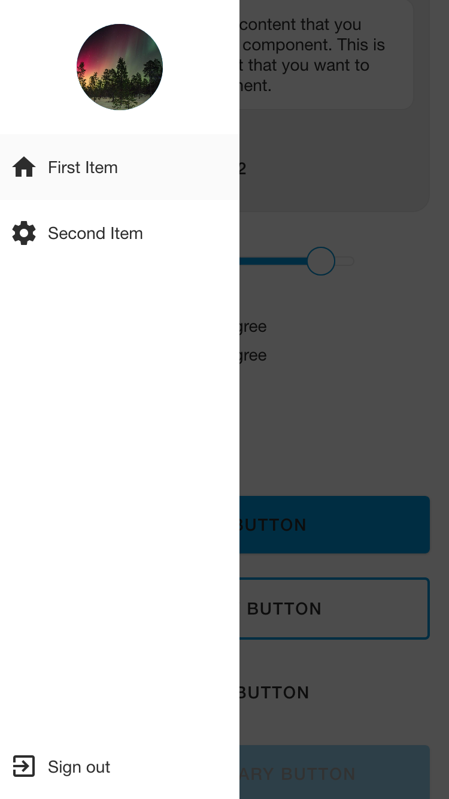

# Drawer.Section

A component to group content inside a navigation drawer.

### Preview




### Props

| Name            |        Type         | Default  | Description                               |
| --------------- | :-----------------: | :------: | ----------------------------------------- |
| `headerMode*`   | `'full' | 'circle'` | `'full'` | The mode of header image.                 |
| `headerSource*` |  `ImageURISource`   |          | Image to display for the header.          |
| `children*`     |     `ReactNode`     |          | Content of the Drawer.Section.            |
| `footerLabel`   |      `string`       |          | The label text of footer item.            |
| `footerIcon`    |      `string`       |          | Icon to display for the footer item.      |
| `footerOnPress` |    `() => void`     |          | Function to execute footer item on press. |

### Example

```tsx
<Drawer.Section
  headerMode="full"
  headerSource={{ uri: 'https://picsum.photos/300' }}
  footerLabel="Sign out"
  footerIcon="exit-to-app"
  footerOnPress={() => alert('Sign out pressed!')}
>
  <Drawer.Item
    label="First Item"
    icon="home"
    active={true}
    onPress={() => {}}
  />
  <Drawer.Item
    label="Second Item"
    icon="settings"
    active={false}
    onPress={() => {}}
  />
</Drawer.Section>
```
