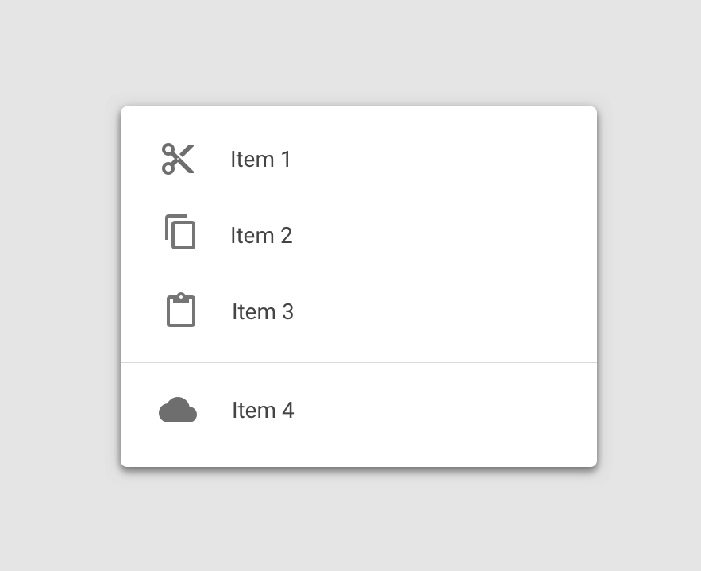
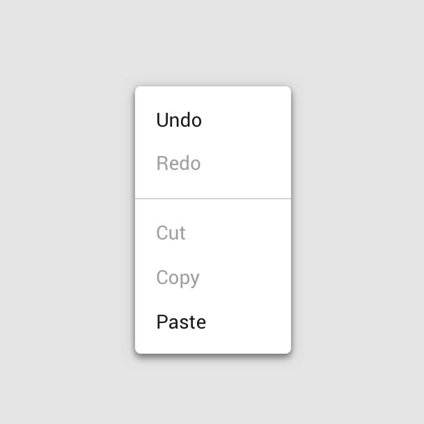

# Menu

Menus display a list of choices on temporary elevated surfaces. Their placement varies based on the element that opens them.

### Preview

<p align="center">
  
  
</p>

### Props

| Name              |                  Type                   |                Default                | Description                                                                                                                                                                                                                                                                         |
| ----------------- | :-------------------------------------: | :-----------------------------------: | ----------------------------------------------------------------------------------------------------------------------------------------------------------------------------------------------------------------------------------------------------------------------------------- |
| `visible \*`      |                `boolean`                |                                       | Whether the Menu is currently visible.                                                                                                                                                                                                                                              |
| `anchor \*`       | `ReactNode \| { x: number, y: number }` |                                       | The anchor to open the menu from. In most cases, it will be a button that opens the menu.                                                                                                                                                                                           |
| `onDismiss \*`    |              `() => void`               |                                       | Callback called when Menu is dismissed. The visible prop needs to be updated when this is called.                                                                                                                                                                                   |
| `children \*`     |               `ReactNode`               |                                       | Content of the Menu.                                                                                                                                                                                                                                                                |
| `statusBarHeight` |                `number`                 | `expo.Constants.statusBarHeight \| 0` | Extra margin to add at the top of the menu to account for translucent status bar on Android. If you are using Expo, we assume translucent status bar and set a height for status bar automatically. Pass 0 or a custom value to customize it. This is automatically handled on iOS. |
| `contentStyle`    |         `StyleProp<ViewStyle>`          |                                       | Style of menu's inner content.                                                                                                                                                                                                                                                      |
| `style`           |         `StyleProp<ViewStyle>`          |                                       | Style of menu's container.                                                                                                                                                                                                                                                          |

Props marked with \* are required.

### Example

```tsx
let [visible, setVisible] = useState(false);

<Provider>
  <Menu
    visible={visible}
    onDismiss={() => setVisible(false)}
    anchor={<Button onPress={() => setVisible(true)}>Show menu</Button>}
  >
    <Menu.Item onPress={() => {}} title="Item 1" />
    <Menu.Item onPress={() => {}} title="Item 2" />
    <Divider />
    <Menu.Item onPress={() => {}} title="Item 3" />
  </Menu>
</Provider>;
```
