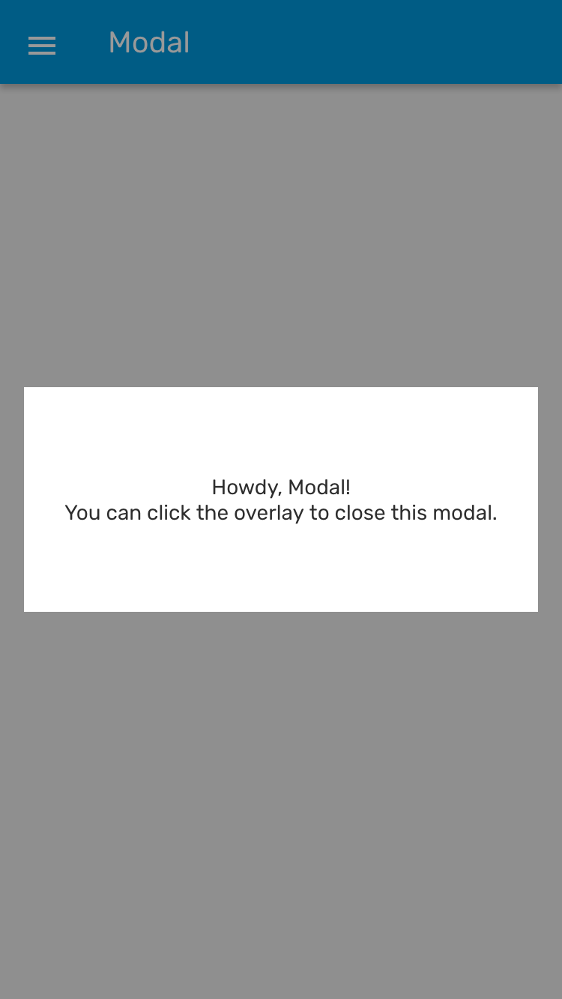
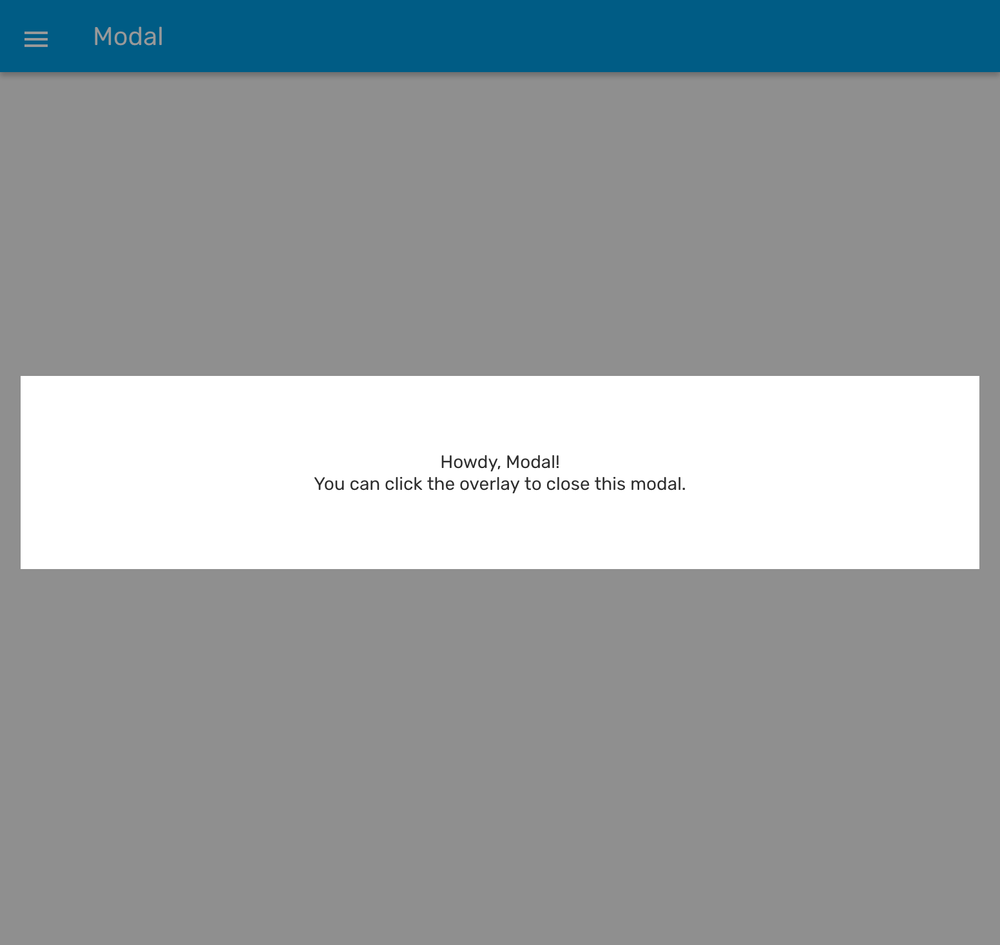

# Modal

The Modal component is a simple way to present content above an enclosing view.

### Preview

<p align="center">
  
  
</p>

### Props

| Name                  |          Type          | Default | Description                                                |
| --------------------- | :--------------------: | :-----: | ---------------------------------------------------------- |
| children \*           |      `ReactNode`       |         | Content of the Modal.                                      |
| dismissable           |       `boolean`        | `true`  | Determines whether clicking outside the modal dismiss it.  |
| onDismiss             |      `() => void`      |         | Callback that is called when the user dismisses the modal. |
| visible               |       `boolean`        | `false` | Determines whether the modal is visible.                   |
| contentContainerStyle | `StyleProp<ViewStyle>` |         | Style for the content of the modal.                        |

Props marked with \* are required.

### Example

```tsx
<Provider>
  <Portal>
    <Modal
      visible={isVisible}
      onDismiss={toggleModal}
      contentContainerStyle={styles.modal}
    >
      <Text>Howdy, Modal!</Text>
      <Text>You can click the overlay to close this modal.</Text>
    </Modal>
  </Portal>
</Provider>
```
