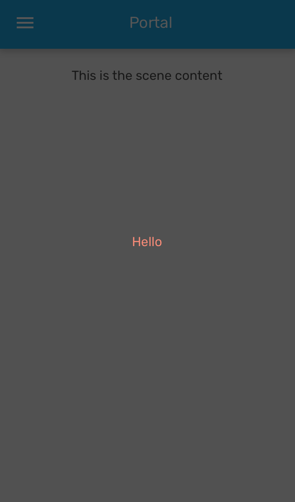

# Portal

Portal allows to render a component at a different place in the parent tree. You can use it to render content which should appear above other elements, similar to Modal. It requires a Portal.Host component to be rendered somewhere in the parent tree.

### Preview



### Props

| Name         |    Type     | Default | Description            |
| ------------ | :---------: | :-----: | ---------------------- |
| `children *` | `ReactNode` |         | Content of the Portal. |

Prop marked with `*` is required.

### Example

```tsx
<Provider>
  <Portal>
    <View style={styles.portalContainer}>
      <Text style={styles.text}>Hello</Text>
    </View>
  </Portal>
</Provider>
```
