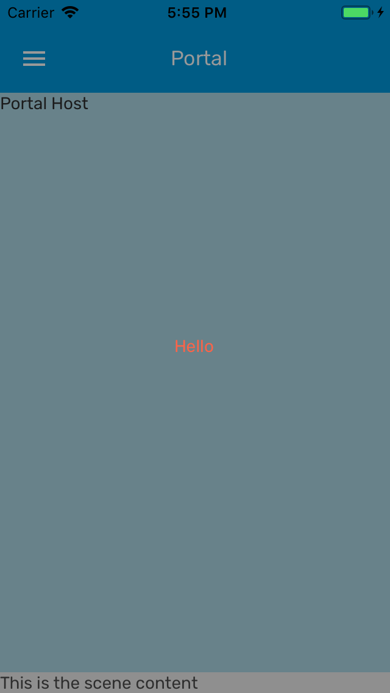

# Portal.Host

Portal host renders all of its children Portal elements. For example, you can wrap a screen in Portal.Host to render items above the screen. If you're using the Provider component, it already includes `Portal.Host`.

### Preview



### Props

| Name         |    Type     | Default | Description                      |
| ------------ | :---------: | :-----: | -------------------------------- |
| `children *` | `ReactNode` |         | Component inside the Portal Host |

Prop marked with `*` is required.

### Example

```tsx
<>
  <Portal.Host>
    <View style={{ flex: 1, backgroundColor: 'lightblue' }}>
      <Portal>
        <View
          style={{
            flex: 1,
            backgroundColor: 'rgba(0,0,0,0.4)',
            justifyContent: 'center',
            alignItems: 'center',
          }}
        >
          <Text style={styles.text}>Hello</Text>
        </View>
      </Portal>
      <Text>Portal Host</Text>
    </View>
  </Portal.Host>
  <View>
    <Text>This is the scene content</Text>
  </View>
</>
```

Here any Portal elements under <App /> are rendered alongside <App /> and will appear above <App /> like a Modal.
