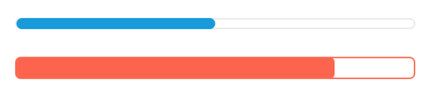

# ProgressBar

An indicator used to present progress of some activity in the app.

### Preview



### Props

| Name            |          Type          |           Default            | Description                                                             |
| --------------- | :--------------------: | :--------------------------: | ----------------------------------------------------------------------- |
| `progress`      |        `number`        |              0               | Progress value (between 0 and 1).                                       |
| `color`         |        `string`        | primary color from the theme | Color of the progress bar.                                              |
| `visible`       |       `boolean`        |            `true`            | Whether to show the ProgressBar (true, the default) or hide it (false). |
| `indeterminate` |       `boolean`        |           `false`            | Whether the progress bar will show indeterminate progress.              |
| `style`         | `StyleProp<ViewStyle>` |                              | Optional style for the progress bar.                                    |

### Example

```tsx
<Provider>
  <ProgressBar progress={0.5} />
  <ProgressBar
    progress={0.7}
    color="tomato"
    style={{ height: 16, borderColor: 'tomato' }}
  />
</Provider>
```
