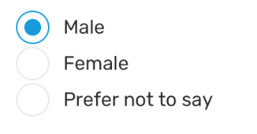

# RadioButton.Group

Radio button group allows to control a group of radio buttons.

### Preview



| Prop            | Type                         | Default     | Description                                                                                                                                                               |
| --------------- | ---------------------------- | ----------- | ------------------------------------------------------------------------------------------------------------------------------------------------------------------------- |
| `value`         | `string`                     | `''`        | Value of the selected radio button.                                                                                                                                       |
| `onValueChange` | `(newValue: string) => void` | `undefined` | Callback function to be called when radio button is pressed.                                                                                                              |
| `children`      | `ReactNode`                  | `undefined` | Any react node, preferable `RadioButton` component(s), If no `RadioButton` is found, children will still be rendered, but `onValueChange` prop will not receive anything. |

### Example

```tsx
let [radioButtonValue, setRadioButtonValue] = useState('');

<Provider>
  <RadioButton.Group
    value={radioButtonValue}
    onValueChange={(newValue: string) => setRadioButtonValue(newValue)}
  >
    <RadioButton label="Male" />
    <RadioButton label="Female" />
    <RadioButton label="Prefer not to say" />
  </RadioButton.Group>
</Provider>;
```
