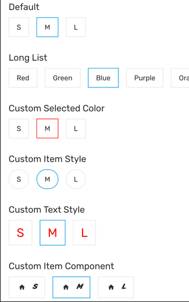

# RichRadioButton

Rich Radio button is a radio button with a better UI and horizontally scrollable. Rich Radio button allow the selection a single option from a set.

### Preview



| Prop                      | Type                                      | Default | Description                                                                |
| ------------------------- | ----------------------------------------- | ------- | -------------------------------------------------------------------------- |
| `data *`                  | `Array<{ label: string; value: string }>` |         | The data given to render on each radio button item.                        |
| `selectedValue *`         | `string`                                  |         | The value that currently being selected by Rich Radio button.              |
| `selectedColor`           | `string`                                  |         | Custom border color for the selected item. Default to theme primary color. |
| `uppercase`               | `boolean`                                 | `false` | Whether to render the text in uppercase or not.                            |
| `onValueChanged *`        | `(value: string) => void`                 |         | A function that will be called when the selected value is changed.         |
| `renderCustomItemContent` | `(label: string) => ReactNode`            |         | A function to render an item with custom content.                          |
| `style`                   | `StyleProp<ViewStyle>`                    |         | Additional style for the root of Rich Radio button.                        |
| `contentContainerStyle`   | `StyleProp<ViewStyle>`                    |         | Additional style for the container of Rich Radio button.                   |
| `itemStyle`               | `StyleProp<ViewStyle>`                    |         | Additional style for the item component.                                   |
| `textStyle`               | `StyleProp<TextStyle>`                    |         | Additional style for the text.                                             |

Props marked with `*` are required.

### Example

```tsx
const DATA = [
  { label: 'S', value: 'small' },
  { label: 'M', value: 'medium' },
  { label: 'L', value: 'large' },
];

let [size, setSize] = useState('');

<Provider>
  <RichRadioButton
    data={DATA}
    selectedValue={size}
    onValueChanged={setSize}
    style={{ marginBottom: 30 }}
  />
  <RichRadioButton
    data={DATA}
    selectedValue={size}
    onValueChanged={setSize}
    renderCustomItemContent={(label) => (
      <View style={{ flexDirection: 'row' }}>
        <IconButton
          icon="home"
          size={14}
          style={{
            padding: 0,
            margin: 0,
            justifyContent: 'center',
            alignItems: 'center',
          }}
        />
        <Text fontStyle="italic" weight="bold" style={{ marginLeft: 10 }}>
          {label}
        </Text>
      </View>
    )}
    style={{ marginBottom: 30 }}
  />
</Provider>;
```
