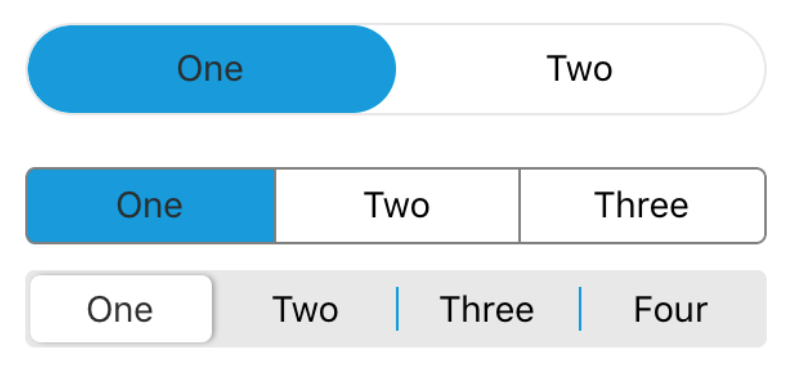

# SegmentedControl

### Preview



| Prop              |                  Type                   |   Default   | Description                                    |
| ----------------- | :-------------------------------------: | :---------: | ---------------------------------------------- |
| `mode`            | `'default'` \| `'border'` \| `'ios-13'` | `'default'` | Variant of the segmented control.              |
| `values`          |             `Array<string>`             |             | List of segment value/label                    |
| `activeIndex`     |                `number`                 |             | Active index of the segmented control.         |
| `onIndexChange`   |   `(newActiveIndex: number) => void`    |             | Callback executed on active index change.      |
| `activeTextStyle` |         `StyleProp<TextStyle>`          |             | Style for the active segment text.             |
| `indicatorStyle`  |         `StyleProp<ViewStyle>`          |             | Style for the indicator.                       |
| `segmentStyle`    |         `StyleProp<ViewStyle>`          |             | Style for the inner segmented control content. |
| `textStyle`       |         `StyleProp<TextStyle>`          |             | Style for the segment text.                    |
| `style`           |         `StyleProp<ViewStyle>`          |             | Style for the outer segmented control.         |
| `dividerColor`    |                `string`                 |             | The color of the divider.                      |
| `disabled`        |                `boolean`                |   `false`   | Whether the segmented control is disabled.     |
| `dividerWidth`    |                `number`                 |     `1`     | The width of the divider.                      |

### Example

```tsx
<Provider>
  <SegmentedControl values={['One', 'Two']} />
  <SegmentedControl
    mode="border"
    values={['One', 'Two', 'Three']}
    style={{ height: 30, borderRadius: 4, borderColor: 'grey' }}
    dividerColor="grey"
  />
  <SegmentedControl mode="ios-13" values={['One', 'Two', 'Three', 'Four']} />
</Provider>
```
