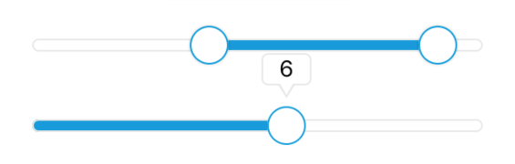

# Slider

A component used to select a single/multiple value(s) from a range of values.
modified from [@ptomasroos/react-native-multi-slider](https://github.com/ptomasroos/react-native-multi-slider)

### Preview



| Prop                       | Type                                                                              | Default                                                                     | Description                                                                                                                                                                                                                  |
| -------------------------- | --------------------------------------------------------------------------------- | --------------------------------------------------------------------------- | ---------------------------------------------------------------------------------------------------------------------------------------------------------------------------------------------------------------------------- |
| `values`                   | `Array<number>`                                                                   | `[0]`                                                                       | Values for the slider. When values length > 1, it becomes multislider. Maximum 2 markers.                                                                                                                                    |
| `showLabel`                | `boolean`                                                                         | `true`                                                                      | Boolean whether slider should display label on marker pressed.                                                                                                                                                               |
| `onValuesChangeStart`      | `(values: Array<number>) => void`                                                 | `(values: Array<number>) => {}`                                             | Callback when the value starts changing.                                                                                                                                                                                     |
| `onValuesChange`           | `(values: Array<number>) => void`                                                 | `(values: Array<number>) => {}`                                             | Callback when the value changes.                                                                                                                                                                                             |
| `onValuesChangeFinish`     | `(values: Array<number>) => void`                                                 | `(values: Array<number>) => {}`                                             | Callback when the value stops changing.                                                                                                                                                                                      |
| `sliderLength`             | `number`                                                                          | `280`                                                                       | Length of the slider.                                                                                                                                                                                                        |
| `touchDimensions`          | `{height: number, width: number, borderRadius: number, slipDisplacement: number}` | `{height: 50, width: 50, borderRadius: 15, slipDisplacement: 200}`          | Area to be touched, should enclose the whole marker. Will be automatically centered and contain the marker.                                                                                                                  |
| `customMarker`             | `ReactNode`                                                                       | Marker with label                                                           | Component used for the cursor.                                                                                                                                                                                               |
| `customMarkerLeft`         | `ReactNode`                                                                       | `undefined`                                                                 | Component used for the left cursor.                                                                                                                                                                                          |
| `customMarkerRight`        | `ReactNode`                                                                       | `undefined`                                                                 | Component used for the right cursor.                                                                                                                                                                                         |
| `isMarkersSeparated`       | `boolean`                                                                         | `false`                                                                     | Boolean whether slider should display label on marker pressed.                                                                                                                                                               |
| `min`                      | `number`                                                                          | `0`                                                                         | Minimum value available in the slider.                                                                                                                                                                                       |
| `max`                      | `number`                                                                          | `10`                                                                        | Maximum value available in the slider.                                                                                                                                                                                       |
| `step`                     | `number`                                                                          | `1`                                                                         | Step value of the slider.                                                                                                                                                                                                    |
| `optionsArray`             | `Array<number>`                                                                   | `undefined`                                                                 | Possible values of the slider. Ignores min and max.                                                                                                                                                                          |
| `containerStyle`           | `StyleProp<ViewStyle>`                                                            | `{position:'relative', height: 50, justifyContent:'center'}`                | Style for the container.                                                                                                                                                                                                     |
| `trackStyle`               | `StyleProp<ViewStyle>`                                                            | `{height: 8, borderRadius: 4, borderWidth: 1}`                              | Style for the track.                                                                                                                                                                                                         |
| `selectedStyle`            | `StyleProp<ViewStyle>`                                                            | `{backgroundColor: ThemeColor.primary}`                                     | Style for the selected track.                                                                                                                                                                                                |
| `unselectedStyle`          | `StyleProp<ViewStyle>`                                                            | `{backgroundColor: ThemeColor.background}`                                  | Style for the unselected track.                                                                                                                                                                                              |
| `markerContainerStyle`     | `StyleProp<ViewStyle>`                                                            | `{marginTop: 4}`                                                            | Style for the marker container.                                                                                                                                                                                              |
| `markerStyle`              | `StyleProp<ViewStyle>`                                                            | `{borderColor: ThemeColor.primary, backgroundColor: ThemeColor.background}` | Style for the marker.                                                                                                                                                                                                        |
| `pressedMarkerStyle`       | `StyleProp<ViewStyle>`                                                            | `undefined`                                                                 | Style for the pressed marker                                                                                                                                                                                                 |
| `valuePrefix`              | `string`                                                                          | `undefined`                                                                 | Prefix added to the value.                                                                                                                                                                                                   |
| `valueSuffix`              | `string`                                                                          | `undefined`                                                                 | Suffix added to the value                                                                                                                                                                                                    |
| `enabledOne`               | `boolean`                                                                         | `true`                                                                      | Enables the first cursor                                                                                                                                                                                                     |
| `enabledTwo`               | `boolean`                                                                         | `true`                                                                      | Enables the second cursor                                                                                                                                                                                                    |
| `onToggleOne`              | `() => void`                                                                      | `undefined`                                                                 | Callback when first cursor toggles                                                                                                                                                                                           |
| `onToggleTwo`              | `() => void`                                                                      | `undefined`                                                                 | Callback when second cursor toggles                                                                                                                                                                                          |
| `allowOverlap`             | `boolean`                                                                         | `false`                                                                     | Allow the overlap within the cursors                                                                                                                                                                                         |
| `snapped`                  | `boolean`                                                                         | `false`                                                                     | Use this when you want a fixed position for your markers, this will split the slider in N specific positions                                                                                                                 |
| `markerOffsetX`            | `number`                                                                          | `0`                                                                         | Offset first cursor                                                                                                                                                                                                          |
| `markerOffsetY`            | `number`                                                                          | `0`                                                                         | Offset second cursor                                                                                                                                                                                                         |
| `minMarkerOverlapDistance` | `number`                                                                          | `0`                                                                         | If this is > 0 and `allowOverlap` is false, this value will determine the closest two markers can come to each other. This can be used for cases where you have two markers large cursors and you don't want them to overlap |
| `imageBackgroundSource`    | `ImageSourcePropType`                                                             | `undefined`                                                                 | Specifies the source as required by ImageBackground                                                                                                                                                                          |

### Example

```tsx
<Provider>
  <Slider values={[3, 9]} showLabel={false} />
  <Slider values={[5]} />
</Provider>
```
