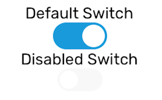

# Switch

A selection control component which values are either on/off (true/false).

### Preview



### Props

| Name            |             Type              |  Default   | Description                                                   |
| --------------- | :---------------------------: | :--------: | ------------------------------------------------------------- |
| `value`         |           `boolean`           |   `true`   | Indicator whether the switch is on (`true`) or off (`false`). |
| `onValueChange` | `(newValue: boolean) => void` | `() => {}` | Callback that is called when the switch is pressed.           |
| `disabled`      |           `boolean`           |  `false`   | If false, switch cannot be pressed.                           |
| `width`         |           `number`            |    `48`    | Width of the switch.                                          |
| `thumbStyle`    |    `StyleProp<ViewStyle>`     |            | Additional view style for the switch thumb.                   |
| `trackStyle`    |    `StyleProp<ViewStyle>`     |            | Additional view style for the switch track.                   |

### Example

```tsx
let [switchValue, setSwitchValue] = useState(false);
<Provider>
  <Switch
    value={switchValue}
    onValueChange={(newValue) => {
      setSwitchValue(newValue);
    }}
  />
  <Switch
    value={switchValue}
    onValueChange={(newValue) => {
      setSwitchValue(newValue);
    }}
    width={40}
    disabled={true}
  />
</Provider>;
```
