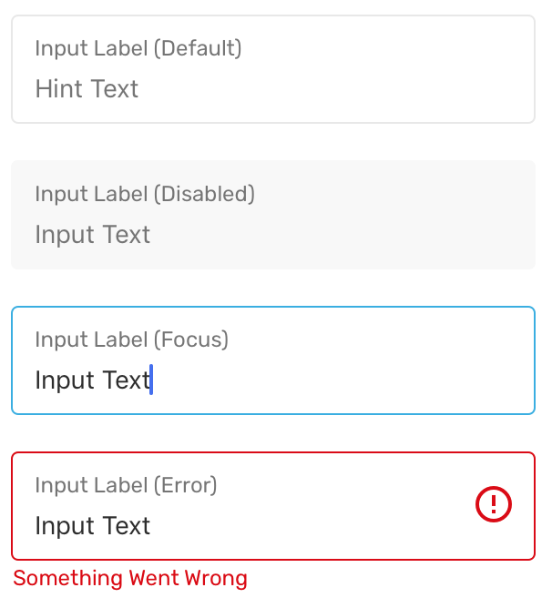

# TextInput

TextInput is used to allow user input using keyboard.

### Preview



### Props

| Name                                                                                |          Type          |  Default   | Description                                                                                                      |
| ----------------------------------------------------------------------------------- | :--------------------: | :--------: | ---------------------------------------------------------------------------------------------------------------- |
| `containerStyle`                                                                    | `StyleProp<ViewStyle>` |            | Additional style passed to the container.                                                                        |
| `disabled`                                                                          |       `boolean`        |  `false`   | When set to true, will disable all interaction with the text input.                                              |
| `errorMessage`                                                                      |        `string`        |            | When provided, will use the error styling for the text input and display the error message below the text input. |
| `errorStyle`                                                                        | `StyleProp<TextStyle>` |            | Additional style passed to the error message.                                                                    |
| `label *`                                                                           |        `string`        |            | Label for the text input.                                                                                        |
| `labelStyle`                                                                        | `StyleProp<TextStyle>` |            | Additional style passed to the label.                                                                            |
| `mode`                                                                              | `'flat' \| 'outlined'` | `outlined` | Determine how the text input is displayed. `mode="flat"` is not yet supported.                                   |
| [TextInputProps](https://facebook.github.io/react-native/docs/textinput.html#props) |    `TextInputProps`    |            | Additional text props will be passed to the inner TextInput component.                                           |

Prop marked with `*` is required.

### Example

```tsx
<Provider>
  <TextInput label="Input Label (Default)" placeholder="Hint Text" />
  <TextInput
    label="Input Label (Disabled)"
    value="Input Text"
    disabled={true}
  />
  <TextInput label="Input Label (Focus)" value="Input Text" />
  <TextInput
    label="Input Label (Error)"
    value="Input Text"
    errorMessage="Something Went Wrong"
  />
</Provider>
```
