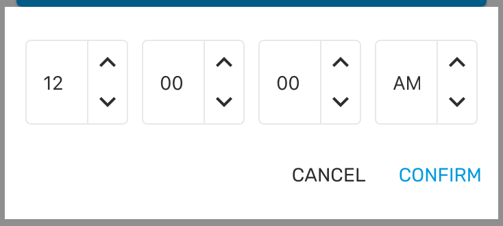

# TimePicker

### Preview

<p align="center">
  
</p>
<p align="center">
  
  
</p>

### Props

| Name           |             Type              | Default | Description                                                          |
| -------------- | :---------------------------: | :-----: | -------------------------------------------------------------------- |
| `date *`       |           `string`            |         | Current date and time in ISO string format.                          |
| `format`       |        `'12' \| '24'`         | `'12'`  | Format to show the time, between 12 hour and 24 hour.                |
| `placeholder`  |           `string`            |  `''`   | Placeholder to show inside the TextInput. (For iOS and Android only) |
| `title`        |           `string`            |  `''`   | The title text on iOS.                                               |
| `onChangeTime` | `(isoString: string) => void` |         | Callback when a time is picked. It returns an ISO string.            |
| `style`        |    `StyleProp<TextStyle>`     |         | Style for the TextInput. (For iOS and Android only)                  |

Props marked with \* are required.

### Example

```tsx
<Provider>
  <TimePicker date={selectedDateTime} onChangeTime={changeTime} />
  <TimePicker date={selectedDateTime} format="24" onChangeTime={changeTime} />
</Provider>
```
