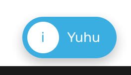

# Toast

Toast is an alert like component that shows from the bottom of the screen.

### Preview



### Props

| Name        |                     Type                      |                                          Default                                           | Description                                     |
| ----------- | :-------------------------------------------: | :----------------------------------------------------------------------------------------: | ----------------------------------------------- |
| `children`  |                   `string`                    |                                                                                            | Text to display in the toast.                   |
| `mode`      | `'info' \| 'warning' \| 'error' \| 'success'` |                                          `'info'`                                          | Determine the color and icon to display.        |
| `colors`    |            `Record<mode, string>`             | `{ info: Themes.colors.accent, warning: '#ffce00', error: '#dc544b', success: '#27a163' }` | Configure the color to use for each mode.       |
| `visible *` |                   `boolean`                   |                                                                                            | Will only display the toast when set to `true`. |
| `showIcon`  |                   `boolean`                   |                                           `true`                                           | Set to `false` to hide the icon.                |
| `style`     |            `StyleProp<ViewStyle>`             |                                                                                            | Additional props passed to the toast container. |
| `textStyle` |            `StyleProp<TextStyle>`             |                                                                                            | Additional props passed to the text.            |

### Static

For the static method to work, `<ToastContainer />` must be rendered.
If the root component has already been wrapped by `<Provider />`, then `<ToastContainer />` is already included.

- `showToast(params)` - show a Toast and then dismiss it after the specified duration has passed.

#### Params

| Name        |                     Type                      | Default  | Description                                    |
| ----------- | :-------------------------------------------: | :------: | ---------------------------------------------- |
| `message *` |                   `string`                    |          | Text to display in the toast.                  |
| `mode`      | `'info' \| 'warning' \| 'error' \| 'success'` | `'info'` | Determine the color and icon to display.       |
| `duration`  |                   `number`                    |  `4000`  | How long the toast stay in the screen (in ms). |
| `showIcon`  |                   `boolean`                   |  `true`  | Show mode icon in the toast.                   |

- `hideToast()` - dismiss the currently visible toast. Does nothing when there's no visible toast.

### Example

```tsx
<Provider>
  <Toast visible={true} mode="info">
    Yuhu
  </Toast>

  <Button
    onPress={() =>
      Toast.showToast({
        message: 'Ouch!',
        duration: 1000,
        mode: 'error',
      })
    }
  />
</Provider>
```
